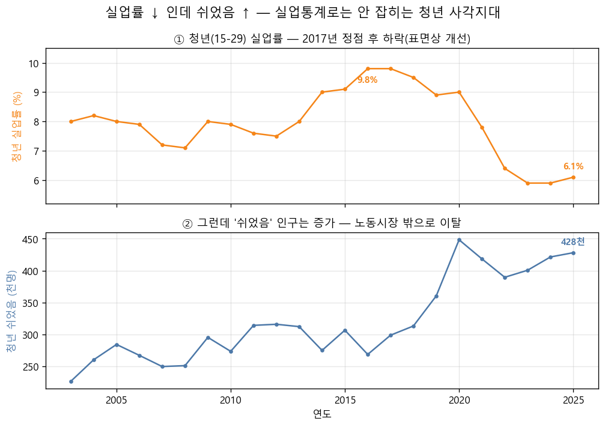
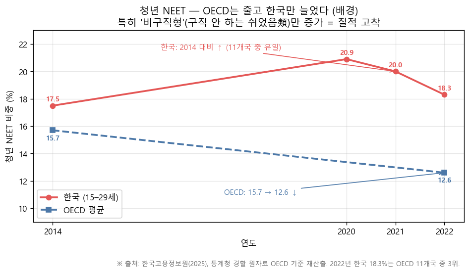
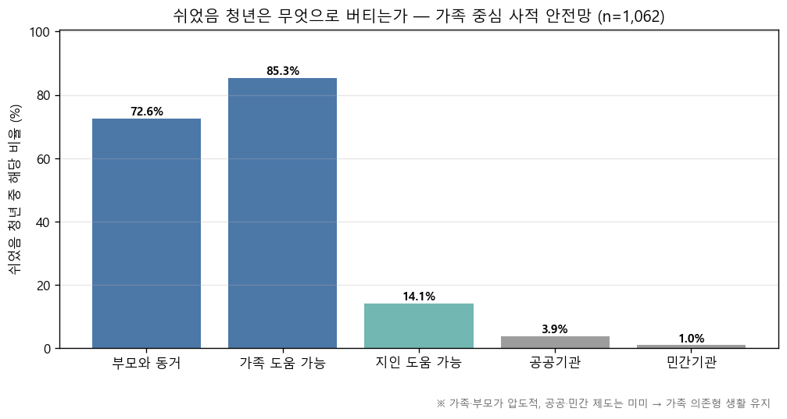
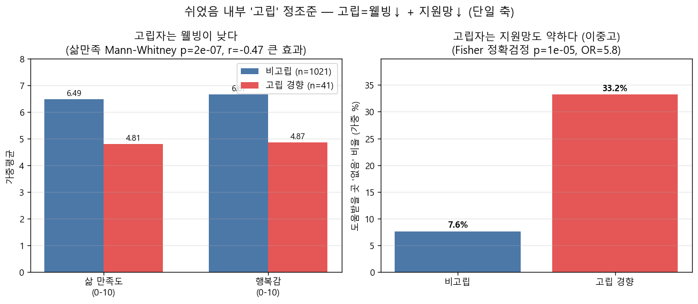
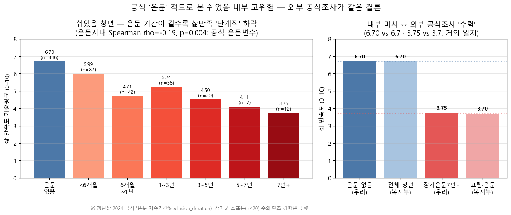
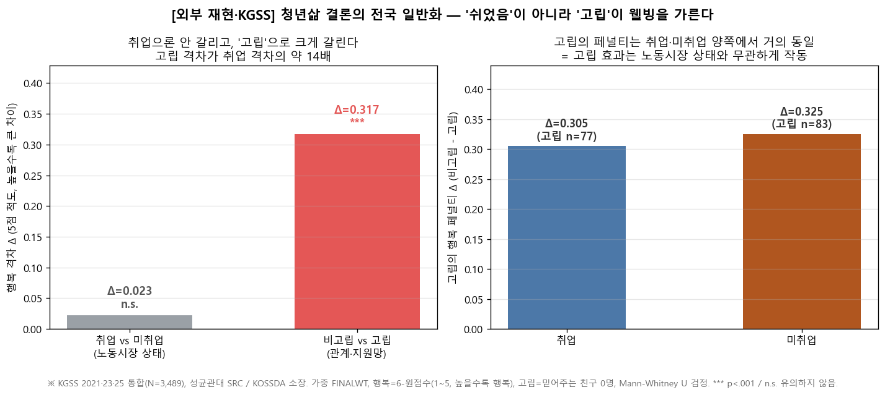
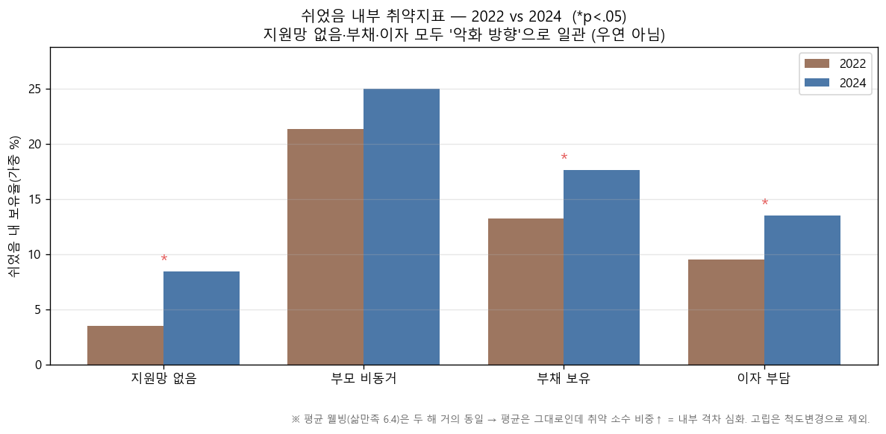
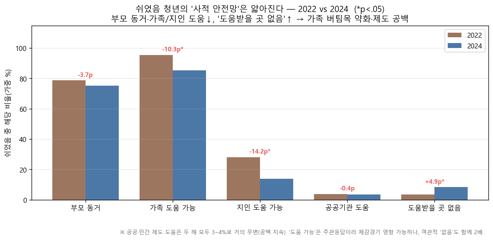

# 발표 초안 (PPT 10장) — 1차 Summary

> KOSSDA 대학생 데이터 시각화 공모전 2026 《데이터로 읽는 한국 사회: 변화와 미래를 그리다》
> 본 문서는 **현재까지 확정된 분석·시각화를 PPT 초안 형태로 모은 것**이다(표지·참고문헌 제외 10장).
> 서사 단일 출처: `docs/analysis_flow.md` · 외부데이터 출처: `docs/external_data_references.md`
>
> **한 줄 메시지**: "'쉬었음' 청년 안에서 더 취약한 곳은 어디인가? → **고립된 청년**. 그리고 이는 전국 데이터(KGSS)에서도 **취업 여부보다 고립이 웰빙을 가른다**로 재현된다."

---

## 제목 (의문형)

# **"일자리가 없는 게 아니라 사람이 없다 — '쉬었음' 청년의 진짜 위기는 어디에 있는가?"**

- 대안1: "'쉬었음' 청년은 정말 쉬고 있을까? — 통계가 놓친 고립의 사각지대"
- 대안2: "왜 어떤 청년은 '쉬어도' 돌아오지 못하는가? — 돈이 아니라 관계"

---

## 슬라이드 1 · 문제제기 — '쉬었음' 청년이 늘고 있다

**메시지**: 청년 실업률은 안정·하락하는데, 노동시장 **밖**의 '쉬었음' 청년은 구조적으로 증가한다. 실업률만 보면 놓치는 사각지대.

- **배경 보강(국제 맥락)**: OECD는 청년 NEET가 줄어드는데 한국만 2014 대비 증가, 그중 '비구직형'(쉬었음類)만 늘었다.

- **데이터**: 경제활동인구조사(EAPS) 집계표 / 한국고용정보원 NEET 재산출.
- **방법**: 연도별 실업률(%)·쉬었음 인구(천 명) 추이(2단 패널, 0기준 고정).
- **인사이트**: "실업률↓ ≠ 청년 고용문제 해결". 쉬었음이라는 **새 범주**에 주목해야 함.

---

## 슬라이드 2 · 연구질문

**문제의식 흐름**
1. 청년 고용문제는 **실업률만으로 설명되지 않는다.**
2. 노동시장 밖에 **'쉬었음' 청년**이 있고, 늘고 있다.
3. 쉬어도 **생활비는 든다** → 이들은 무엇으로 버티는가?
4. 다수는 **가족**으로 버틴다. 그런데 **모두가 안전한가?**

> ## **연구질문: "'쉬었음' 청년은 단일 집단이 아니다. 그 안에서 더 취약한 곳은 어디이며, 무엇이 그것을 가르는가?"**

- 가설: 취약을 가르는 축은 **돈(경제)** 이 아니라 **관계(사회적 고립)** 일 것이다.

---

## 슬라이드 3 · 데이터 선택과 분석 방법

| 데이터 | 출처/소장 | 역할 | 접근(링크/DOI) |
|---|---|---|---|
| 청년삶실태조사 **2024·2022** | 국무조정실·한국보건사회연구원 (MDIS) | **메인 미시분석** | https://mdis.kostat.go.kr |
| 경제활동인구조사(EAPS) | 통계청 (KOSIS) | 배경(쉬었음 추이) | https://kosis.kr |
| **한국종합사회조사(KGSS) 2003–2025** | 김지범·성균관대 SRC / **KOSSDA 소장** | **전국 일반화(KOSSDA·KGSS상)** | https://doi.org/10.22687/KOSSDA-A1-CUM-0074-V1 |
| 한국노동패널(KLIPS) 26차(2023) | 한국노동연구원 / **KOSSDA 소장** | 가구부채 보조 | KOSSDA 자료인용서식(DOI) |
| (외부검증) 복지부 2023 고립·은둔 청년 실태조사 / OECD·고용정보원 NEET | 보건복지부 / 한국고용정보원 | 결과 외적 타당도 | 보고서 인용 |

- **'쉬었음' 정의**(청년삶): 경제활동상태=비경제활동 **그리고** 지난주 주된활동=쉬었음 → 2024 기준 **1,062명**(가중 약 7.2%).
- **분석 방법**: 가중(`weight_person`/`FINALWT`) 비율·평균·**모집단 추정**, 집단비교 **Mann-Whitney U**·**카이제곱**·**Fisher 정확검정**(소표본 2×2)·**Spearman**(용량반응), **효과크기**(rank-biserial r, Cramér's V) 병기.
- **원칙**: 평균·막대만 제시하지 않고 **p값·효과크기·표본수**를 함께 보고. 소표본은 과대해석 금지.

---

## 슬라이드 4 · 무엇으로 버티나 — 가족 중심 생존

**메시지**: 쉬었음 청년의 **다수(약 85%)는 가족 비공식 지원망**으로 생활비를 버틴다. 그래서 평균 경제지표만 보면 "괜찮아 보인다" — 이 평균이 **내부 격차를 가린다.**

- **데이터/방법**: 청년삶 2024, "생활비 부족 시 도움 가능한 곳"(복수응답) 가중 비율.
- **인사이트**: 버티는 방식이 **가족 한 곳에 쏠려** 있다 → 그 **가족 버팀목이 얇은 일부**가 위험군 후보. "평균이 가린 그늘"을 다음 장에서 연다.

---

## 슬라이드 5 · ★핵심★ 내부 취약을 가르는 축 = 사회적 고립

**메시지**: 쉬었음 내부를 갈라보면, 취약을 결정하는 건 부채·소득이 아니라 **'고립'**. 고립된 청년은 삶 만족이 급락하고, 도움받을 곳도 없는 **이중고**.

- **데이터/방법**: 청년삶 2024 쉬었음 1,062명. 고립(외출빈도 기반) 여부로 분할, **Fisher 정확검정**(소표본 2×2)·효과크기.
- **인사이트**: 고립 청년은 **삶 만족도 상관 r≈-0.47**, **'도움없음' 오즈비 약 5.8배**(Fisher 유의). → 취약의 핵심 축은 **관계 단절**.

---

## 슬라이드 6 · 고립의 심도 — 공식 '은둔' 지표 용량반응 + 외부 수렴

**메시지**: 파생 고립지표를 넘어, **공식 '은둔 지속기간' 변수**로 보면 은둔이 길수록 삶 만족이 **단조 하락**(용량반응). 그리고 정부 공식조사와 **수치가 수렴**한다.

- **데이터/방법**: 청년삶 2024 `seclusion_duration`, 가중 평균 삶만족, Spearman 추세. 외부: 복지부 2023 고립·은둔 청년 실태조사.
- **인사이트**: 은둔 없음 **6.70** → 장기 은둔 **3.75**로 하락, 외부조사(일반청년 6.7 vs 고립·은둔 3.7)와 **거의 일치** → 우리 발견이 측정·표본을 넘어 **견고**.

---

## 슬라이드 7 · 전국 일반화 (KGSS) — '쉬었음'이 아니라 '고립'이 웰빙을 가른다

**메시지**: 청년삶은 전원이 쉬었음이라 "고립 vs 노동상태" 비교가 불가능하다. **KGSS 전국 표본**이 이를 대신한다: **취업 여부로는 행복이 안 갈리고(무의미), 고립 여부로는 크게 갈린다(약 14배).**

- **데이터/방법**: KGSS 2021·23·25 통합 **N=3,489**, 가중 FINALWT. 취업(`EMPLY`)·고립(믿는 친구 0명 `BESTFRND`)·행복(`HAPPINSS`). Mann-Whitney U·효과크기.
- **인사이트**: 고립 격차 **0.317\*\*\*** vs 취업 격차 **0.023 n.s.**, 고립 페널티는 취업·미취업 **양쪽에서 동일**. → "노동시장 라벨이 아니라 **고립**이 웰빙을 가른다"는 피벗을 **전국·독립표본이 재현**.
- **의의**: KOSSDA 소장 데이터(SRC 기탁)를 **실질 분석**으로 활용 → **「KGSS상」 트랙** 자격.
- (부록) 친구수 용량반응 `25_*`, 2012 외로움→우울 수렴 `26_*`.

---

## 슬라이드 8 · 재현·악화 — 2022 → 2024

**메시지**: 한 해의 우연이 아니다. 동일 정의로 2022를 처리하면, 쉬었음 규모도 내부 취약도 **모두 악화**됐고, **사적 안전망(가족)은 얇아졌다.** 평균 웰빙은 그대로인데 내부 격차만 깊어진다.

- **데이터/방법**: 청년삶 2022·2024 동일 전처리, 연도 간 카이제곱.
- **인사이트**: 쉬었음 비중 **5.2→7.2%**, 지원망없음·부채·이자 **모두↑·유의**. 가족도움 **95→85%**, 도움없음 **3.5→8.4%**(거의 2배). → "쉬었음이 늘었고, 버팀목은 얇아졌다."
- *주의*: 고립지표는 2022·2024 척도가 달라(7점↔8점) 연도 직접비교에서 제외.

---

## 슬라이드 9 · 토의 — 질문과 대답, 그리고 한계

- **질문↔대답**: "쉬었음 내부에서 더 취약한 곳?" → **고립된 청년**(슬라이드 5–6). "쉬었음만의 변덕인가?" → 아니다, **전국에서도 고립>노동**(슬라이드 7).
- **선행연구와의 차별점**: 「청년들은 왜 캥거루가 되었는가?」(2025 수상작)는 *거주 독립·심리적 자본*을 다뤘다. 본 연구는 ① 대상이 **'쉬었음'(노동시장 밖)**, ② 축이 **사회적 고립(관계)**, ③ **KGSS 전국 일반화**라는 점에서 구별된다.
- **한계**: ① 소표본 하위집단(고립·도움없음 n≈수십)은 효과크기로 보고·경향 해석. ② 데이터 간 개인 결합 불가 → 층위별 근거 결합. ③ KGSS 청년 부분표본은 과소(고립 청년 연도별 n 작음) → **전국 성인 일반화까지만** 주장. ④ 인과 아님(관찰연구).

---

## 슬라이드 10 · 결론 · 정책 함의

**결론**: '쉬었음' 청년은 단일 집단이 아니다. 다수는 가족으로 버티지만, 그 안에 **관계가 끊긴 고립층**이 사각지대로 존재하며, 이는 2024로 갈수록 **두꺼워지고** 가족 버팀목은 **얇아졌다.** 전국 데이터(KGSS)도 **고립이 취업보다 웰빙을 가른다**고 말한다.

**정책 함의**
- '쉬었음'을 일자리 미스매치로만 보지 말고, **고립 여부로 우선 타게팅.**
- 사각지대(고립·도움없음)는 소득지원보다 **사회적 연결·접촉 기반 개입**(관계망 재건)이 핵심.
- 가족 의존이 얇아지는 추세 → **공적 안전망**이 가족을 보완해야.

---

## 부록 (Q&A·보강)

- `25_kgss_friends_doseresponse.png` — 친구 수↑ → 행복↑ 단조(특히 0명이 절벽), KGSS 2021·23·25.
- `26_kgss_loneliness_depression_2012.png` — 외로움↑ → 우울↑(MWU p<1e-23), 다른 해·다른 측정 수렴.
- `09_klips_supplement.png` — KLIPS 2023 비취업 청년 가구부채 다소↑(방향 참고).
- (폐기) 군집화 13–19·취약 스펙트럼 12/22·유형화 10/11 — 자연 군집 없음(D1)·비단조(D7)로 본편 제외, 방법론 이력만 보존.

## 데이터 인용서식 (KOSSDA)
- **KGSS**: 김지범. 한국종합사회조사, 2003-2025 [누적자료] [데이터 세트]. 성균관대학교 서베이리서치센터 [연구수행기관]. 한국사회과학자료원(KOSSDA) [자료제공기관], 2026-03-27, https://doi.org/10.22687/KOSSDA-A1-CUM-0074-V1.
- **KLIPS**: 한국노동패널조사(KLIPS) 26차, 한국노동연구원 / KOSSDA 소장 — 자료별 메타데이터 '자료인용서식'(DOI) 사용.
- **청년삶실태조사 2022·2024**: 국무조정실, MDIS, 조회 링크·자료명 명시.
