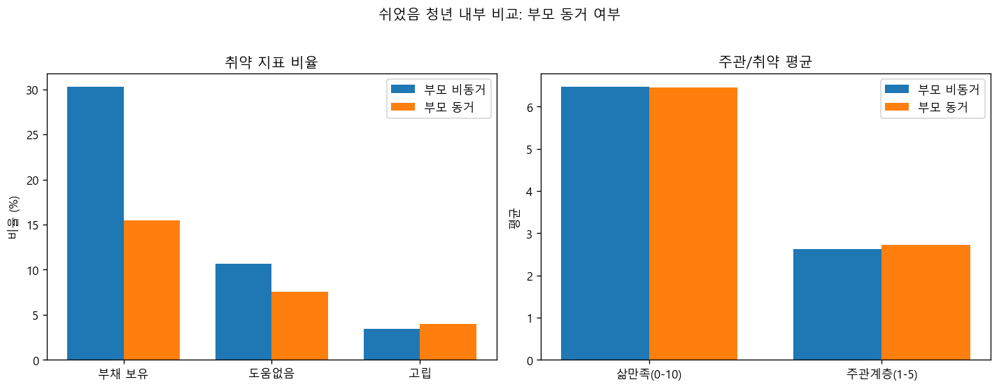
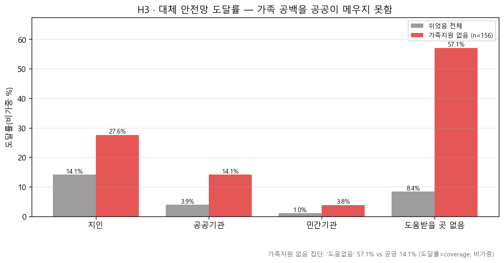
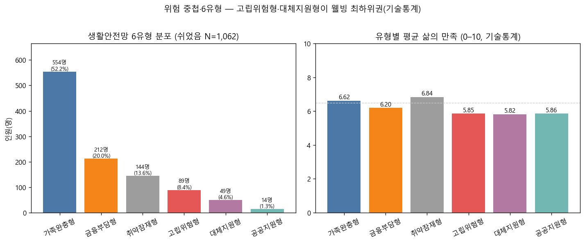
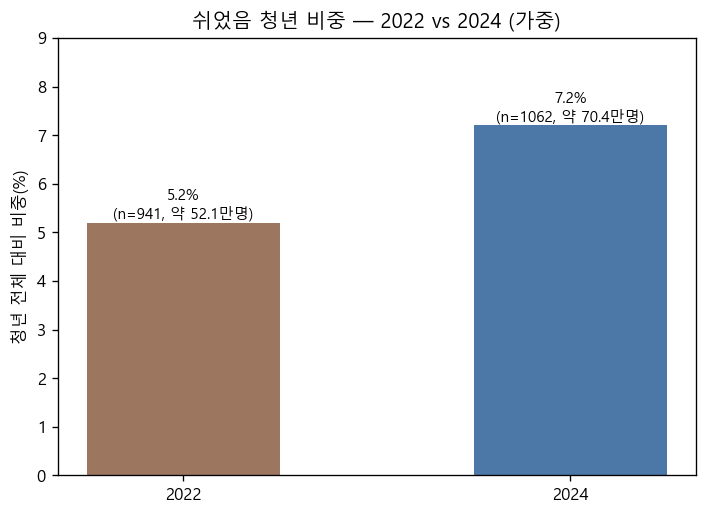
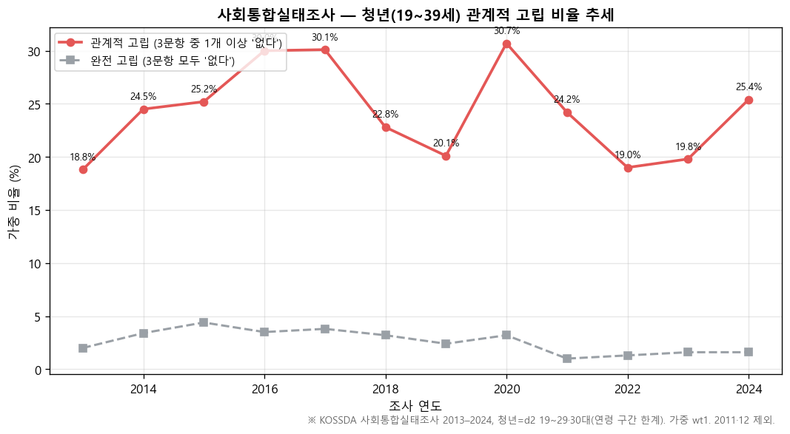
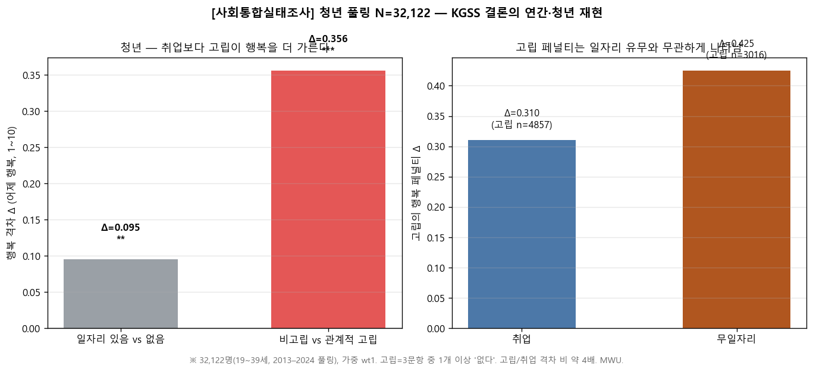

# 쉬었음 청년의 생활안전망 격차: 가족·공공·금융 자원의 분화와 고립의 누적 — 실증 분석(v2)

**저자**: 〔저자명 placeholder〕
**소속**: 숙명여자대학교
**작성일**: 2026.06 (v2)

> ⚠️ **자료 사용에 관한 일러두기 (v2)**
> 본문의 **기술통계·검정 결과·효과크기·강건성 점검·표본 수치는 전부 실제 데이터에서 직접 산출한 값**이다
> (청년삶실태조사 2024 쉬었음 N=1,062 · 2022 비교 · EAPS 집계표 · KGSS 2021/23/25 누적 N=3,489 · 산출 코드:
> `scripts/robustness.py`, `scripts/kgss_isolation.py`, `scripts/cohesion_trend.py`, `scripts/compare_years.py`, `src/queries.py`).
> v1에서 임시값이던 **EAPS 추이·사후 검정력은 실계산으로 교체**하였다.
> 남은 임시 표기 〔mockdata〕는 **선행연구의 구체 서지·연도와 조사 표집 설계의 세부**뿐이며, 제출 전 확인·교체가 필요하다.

---

## 초록

본 연구는 노동시장 밖에 머무는 '쉬었음' 청년이 **무엇으로 생활을 유지하는가**라는 질문에서 출발하여, 이들이 의존하는 생활안전망의 **내부 격차**와 그 격차의 끝에 있는 **사회적 고립의 누적**을 실증한다. 2024년 청년 대상 실태조사(쉬었음 N = 1,062)를 활용하고, 0의 비중이 큰(zero-inflated) 금액 변수는 평균 대신 **보유율·보유자 중앙값**으로, 집단 비교는 **비모수 검정(Mann–Whitney U, 카이제곱·Fisher)에 효과크기(rank-biserial r, Cramér's V)를 병기**하여 분석하였다.

분석 결과, 첫째, 부모와 **비동거**하는 청년의 부채 보유율(30.2%)은 동거 청년(15.4%)의 약 두 배였다(χ²(1) = 28.6, *p* < .001, V = .164). 둘째, 가족지원 가용성은 생활비 수준과 유의하게 연관되었다(중앙값 200 vs 175만 원, *p* < .001, r = .17). 셋째, **가족지원이 없는 청년(n = 156)의 57.1%는 어디에도 도움을 청할 곳이 없었고 공공기관 도달률은 14.1%에 그쳐**, 공공 안전망이 가족 공백을 대체하지 못했다. 넷째, 위험요인 2개 이상 중첩 위험군이 23.0%였다. 다섯째, **고립 청년의 삶 만족 중앙값은 4.0으로 비고립(7.0) 대비 급락**했고(r = .47), 이는 **전국 성인 표본(KGSS, N = 3,489)에서 고립(Δ = 0.317, *p* < .001)이 취업 여부(Δ = 0.023, n.s.)보다 행복을 더 크게 가름**으로 재현되었다. 여섯째, 2022→2024년 쉬었음 비중·가족 도움·도움없음 지표가 악화 방향으로 변했다(각각 유의). 본 연구는 쉬었음 청년 정책의 축을 '돈·일자리'에서 **'안전망 유형별 차등 + 관계망 재건'** 으로 전환할 것을 제언한다.

**주제어**: 쉬었음 청년, 청년 비경제활동, 생활안전망, 사회적 고립, 위험요인 중첩, 비모수 분석, 효과크기

---

## 1. 서론

### 1.1 연구 배경

구직 활동조차 하지 않고 스스로 "쉬었다"고 응답하는 '쉬었음' 청년은 한국 사회의 주요 의제로 부상하였다. 경제활동인구조사 집계에 따르면 15–29세 쉬었음 인구는 **2003년 22.7만 명에서 2020년 44.8만 명으로 정점을 찍은 뒤 2025년에도 42.8만 명** 수준을 유지하고 있다(통계청 경제활동인구조사; 본 연구 산출). 약 20년 사이 두 배 가까이 늘어난 셈이다. 더 주목할 점은 같은 기간 청년 실업률이 안정·하락 추세였다는 사실이다. 즉 실업 통계만으로는 포착되지 않는 **노동시장 밖의 청년층**이 구조적으로 늘고 있다. 그러나 공적 논의는 대체로 **규모(몇 명인가)** 에 집중되어 왔고, 정책 설계에 필요한 질문 — **"이 청년들은 노동시장 밖에 있는 동안 어떤 자원으로 생계를 유지하는가"** — 에는 답하지 못한다.

**그림 1.** 청년(15–29세) 실업률(%)과 쉬었음 인구(천 명) 추이 — 경제활동인구조사 집계표. 단위가 달라 2단 패널로 분리, 세로축 0 고정. 2020년 이후 실업률은 하락하는데 쉬었음은 증가·고착 → 실업률만으로는 포착되지 않는 사각지대.

### 1.2 문제 제기와 연구 공백

'쉬었음 청년'을 하나의 동질적 취약 집단으로 묶는 시각은 중요한 사실을 가린다. 같은 비경제활동 상태라도 **부모와 동거하며 가족의 경제적 완충을 받는 청년**과, **가족 자원이 끊긴 채 부채로 생활을 메우거나 어떤 도움도 받지 못하는 청년**의 처지는 근본적으로 다르다. 문제의 본질은 '쉬었음'이라는 상태 자체보다, 그 상태를 견디게 하는 **생활안전망의 분포와 격차**에 있다. 선행연구는 청년 니트(NEET)의 결정요인이나 심리·정서적 측면을 다루어 왔으나 〔mockdata: 관련 국내 연구 서지 검증 필요〕, 쉬었음 청년 **내부의 자원 격차를 다차원적으로 유형화**하고, 그 격차가 **주관적 웰빙의 격차로 이어지는지**, 나아가 그 양상이 **전국 일반 표본에서 재현되는지**까지 검증한 연구는 드물다.

### 1.3 연구 목적 및 질문

- **RQ1.** 가족 자원(부모 동거·가족지원)은 쉬었음 청년의 경제적 위험과 어떻게 연관되는가?
- **RQ2.** 가족 자원이 부재할 때, 공공 안전망은 그 공백을 보완하는가? (도달률 coverage로 식별)
- **RQ3.** 위험요인은 청년 집단 내에 어떻게 분포·중첩되며, 어떤 유형으로 구조화되는가?
- **RQ4.** *(v2 신규)* 안전망 격차는 주관적 웰빙의 격차로 이어지는가? 특히 격차의 최심부인 **사회적 고립**은 웰빙과 어떻게 연관되며, 이 연관은 **전국 표본에서도 재현**되는가?

### 1.4 연구의 기여

본 연구의 기여는 네 가지다. (1) 0-팽창 변수에 **보유율·보유자 중앙값**을 채택하고 **비모수 검정 + 효과크기**를 일관 적용하여, 대표본에서 p값만으로 과잉해석하는 오류를 차단한다. (2) 공공 안전망의 공백을 선택편향에 취약한 상관이 아니라 **도달률(coverage)** 로 식별한다. (3) 연구자 정의 지표(위험점수·유형)에 **민감도 분석**(요인 제외, 임계값 변경, 분류 규칙 스왑)과 **가중치 재산출**을 수행하여 결과의 강건성을 보고한다. (4) 미시 발견(고립–웰빙)을 **독립된 전국 표본(KGSS)** 으로 외적 타당성 검증하고, **2개 연도(2022·2024)** 로 추세 재현성을 확인한다.

---

## 2. 이론적 배경 및 선행연구

> 본 절의 학술적 인용은 분야의 연구 흐름을 서술한 것이며, **개별 문헌의 저자·연도·서지는 검증 후 교체가 필요**하다 〔mockdata〕.

### 2.1 청년 비경제활동과 '쉬었음'

청년 비경제활동은 국제적으로 NEET 개념으로 논의되어 왔으며, 한국의 '쉬었음'은 구직 단념·노동시장 이탈의 한 양상으로 이해된다 〔mockdata: OECD NEET 정의 및 국내 적용 연구〕. 쉬었음을 **개인적 선택(휴식)** 으로 보는 시각과 **구조적 배제**로 보는 시각이 경합해 왔는데, 본 연구는 후자의 관점에서 쉬었음이 지속되는 동안의 **생활 유지 기반**에 주목한다.

### 2.2 가족 의존과 사적 안전망

한국 청년의 생활 유지에서 가족은 핵심적 사적 안전망으로 기능한다 〔mockdata〕. 부모 동거는 주거비·생활비를 흡수하는 경제적 완충으로 작동하지만, 동시에 **가족 자원의 유무가 청년 간 불평등을 재생산**하는 통로가 된다. 가족지원을 전제로 한 정책은 가족 자원이 약한 청년을 사각지대에 남길 위험이 있다.

### 2.3 공적 안전망과 그 공백

가족 자원이 부재한 청년에게 공적 이전소득·공공서비스는 대체 안전망으로 기대되지만, 청년층은 전통적 사회보장의 사각지대에 놓이기 쉽다 〔mockdata〕. 본 연구는 공적 안전망이 실제로 가족 공백을 보완하는지를 데이터로 검증한다.

### 2.4 위험의 중첩, 누적 취약성, 그리고 고립

빈곤·고립·부채 등 위험요인은 독립적으로 작동하기보다 특정 집단에 **누적·중첩**되는 경향이 있다(누적 불이익) 〔mockdata〕. 본 연구는 다중 위험요인을 합산한 **위험점수**로 이를 조작화하되, 한 걸음 더 나아가 중첩의 **최심부에 있는 사회적 고립**(도움망 부재·관계 단절)이 경제 변수와 구분되는 독자적 취약 축인지를 검증한다. 사회적 고립과 주관적 웰빙의 연관은 일반 인구에서 확립된 발견이지만 〔mockdata〕, 본 연구의 질문은 그보다 구체적이다: **노동시장 밖 청년에게 웰빙을 가르는 것은 돈(부채·소득)인가, 관계(고립)인가.**

---

## 3. 연구가설

- **H1.** 부모와 비동거하는 쉬었음 청년은 동거 청년보다 부채 보유 위험이 높을 것이다. *(RQ1)*
- **H2.** 가족지원 가용성은 생활비 수준과 유의하게 연관될 것이다. *(RQ1)*
- **H3.** 가족 자원이 부재한 청년에게 공공 안전망의 도달률은 낮아, 공공이 가족 공백을 충분히 대체하지 *못할* 것이다. *(RQ2)*
- **H4.** 위험요인은 고르게 분포하기보다 소수 집단에 중첩되어 나타날 것이다. *(RQ3)*
- **H5.** *(v2 신규)* 생활안전망 유형 간 주관적 웰빙(삶의 만족)에 차이가 있을 것이며, 특히 **고립**은 부채 등 경제 변수보다 웰빙과 더 강하게 연관될 것이다. *(RQ4)*
- **H6.** *(v2 신규)* "고립이 웰빙을 가른다"는 연관은 쉬었음 청년에 국한되지 않고 **전국 성인 표본에서 노동시장 지위와 독립적으로 재현**될 것이다. *(RQ4)*

---

## 4. 연구방법

### 4.1 자료 및 표본

주 분석 자료는 2024년 청년 대상 실태조사(만 19–34세, 전체 N = 15,098)이며, 분석 대상은 경제활동상태가 비경제활동이고 주된 활동이 '쉬었음'인 **청년 1,062명**이다(육아·가사·통학·취업준비 등과 구분되는 순수 쉬었음). 추세 재현성 확인에는 동일 정의·동일 전처리를 적용한 2022년 조사(쉬었음 n = 941)를, 전국 일반화에는 **한국종합사회조사(KGSS) 2021·2023·2025 누적 자료(N = 3,489; 성균관대 SRC / KOSSDA 소장)** 를, 청년 고립의 **연간 추세 보조 검증**에는 **사회통합실태조사 2013–2024 연도별 자료(청년 풀링 N = 32,122; 한국행정연구원 / KOSSDA 소장)** 를, 배경 추이에는 경제활동인구조사(EAPS) 공식 집계표를 사용하였다. 〔mockdata: 표집 방법·응답률 등 조사 설계 세부 — 원 조사 문서로 확인 필요〕. 금액 변수는 1인 기준이며 소득·이전소득은 연 단위, 생활비·이자는 월 단위로 조사되어 비교 시 단위를 일치시켰다.

### 4.2 변수의 조작적 정의

**(1) 위험점수(0–5).** ① 부모 비동거, ② 가족지원 없음, ③ 도움받을 곳 없음, ④ 부채 보유, ⑤ 이자 부담의 합. 위험수준은 저(0–1)·중(2–3)·고(4–5)로 구분.

**(2) 생활안전망 유형(6유형).** 우선순위 규칙: 고립위험형(도움망 없음) → 금융부담형(부채·이자·생활비부채) → 가족완충형(가족지원·부모동거) → 공공지원형 → 대체지원형(지인·민간) → 취약잠재형.

**(3) 0-팽창 변수.** 부채·이자·사적/공적 이전소득은 **보유율**(값 > 0 비율)과 **보유자 중앙값**으로 표현.

**(4) 사회적 고립.** 두 측정을 병행한다. (a) **행동적 고립**: 외출 빈도가 '방/집에서 거의 나가지 않음' 수준인 응답(쉬었음 내 n = 41, 3.9%), (b) **공식 은둔 지속기간** 변수(용량반응 확인용). KGSS에서는 (c) **관계적 고립**: 의지할 수 있는 친구가 없음(BESTFRND = 0명)으로 정의한다. 측정이 서로 다른 구성개념(행동/관계)을 포착함은 6.3절에서 논의한다.

**(5) 주관적 웰빙.** 삶의 만족(0–10), 행복감(0–10); KGSS는 행복(HAPPINSS, 역코딩 1–5). 사회통합실태조사는 어제 행복(q1_1, 1–10)을 사용한다.

**(6) 관계적 고립(사회통합실태조사).** 다음 세 문항에 각각 「의지할 사람이 **없다**」(코드 1)고 응답했는지 본다: ① 목돈이 필요할 때 빌릴 수 있는 사람, ② 몸이 아플 때 도와줄 수 있는 사람, ③ 우울할 때 사적으로 대화할 수 있는 사람. **세 영역 중 하나라도** '없다'이면 관계적 고립(완전 고립은 세 문항 모두 '없다'). 분석 연도는 **2013–2024**(12개 연도)이며, 동일 3문항 블록이 없는 **2011·2012년 자료는 제외**하였다. 연도마다 SPSS 변수명(q26, q28, q31 등)은 달라지므로, .sav에 포함된 **문항 설명(변수 라벨)** 로 동일 문항을 맞추었다(매핑표: `docs/social_cohesion_varmap.md`). 청년은 연령 구간변수 d2(19~29세·30대)로 **19~39세를 근사**한다.

### 4.3 분석 방법

분포가 0에 치우치고 비정규적이므로 **비모수 검정**을 채택하였다: 연속형 두 집단 비교는 **Mann–Whitney U**, 범주형 연관은 **카이제곱**(2×2에서 기대빈도 < 5이면 **Fisher 정확검정**으로 자동 전환), 3개 이상 집단 비교는 **Kruskal–Wallis**(사후검정은 쌍별 MWU에 Holm 보정). 표본이 크면 작은 차이도 유의하므로 **모든 검정에 효과크기(rank-biserial r, Cramér's V)를 병기**하고, 한 집단 n < 10이면 검정을 생략하였다. H1–H4는 사전 설정된 확인적(confirmatory) 가설로, 그 외 분석은 탐색적으로 구분한다. 쉬었음 내부 분석은 비가중으로 수행하되 **핵심 수치는 표본 가중치로 재산출하여 방향 유지를 확인**하였고(5.9절), 연구자 정의 지표에는 **민감도 분석**을 수행하였다(5.9절). 유의수준 .05(양측). 분석은 Python 3(pandas, SciPy)로 수행했으며 전 과정은 공개 코드로 재현 가능하다.

---

## 5. 분석 결과

### 5.1 기술통계

위험점수 평균은 0.84점, 분포는 0점에 집중되었으며(표 1), 위험요인 **2개 이상 중첩 위험군은 23.0%** 였다.

**표 1. 위험점수 분포 (N = 1,062)**

| 위험점수 | 0 | 1 | 2 | 3 | 4 | 5 |
|---|---|---|---|---|---|---|
| 인원(명) | 554 | 264 | 143 | 76 | 15 | 10 |
| 비율(%) | 52.2 | 24.9 | 13.5 | 7.2 | 1.4 | 0.9 |

**표 2. 자원·부담 변수의 보유율과 보유자 중앙값**

| 변수 | 보유율(%) | 보유자 중앙값 |
|---|---|---|
| 부채 총액 | 19.5 | 1,000만 원 |
| 월평균 이자 | 13.7 | 18만 원/월 |
| 사적 이전소득 | 27.4 | 480만 원/년 |
| 공적 이전소득 | 14.3 | 138만 원/년 |

생활안전망 측면에서 가족 도움 가능 응답이 85.3%로 압도적이었던 반면, **공공기관은 3.9%에 불과**했고 **도움받을 곳 없음이 8.4%** 로 공공 응답률을 상회하였다.

**그림 2.** 쉬었음 청년(N = 1,062)의 생활 유지 기반 — 부모 동거·가족·지인 도움 가능 비율(비가중 %). 가족 중심 사적 안전망이 압도적이고 공공·민간 제도는 미미함 → 평균적 안정은 가족이 만든 착시.

### 5.2 가족 자원과 경제적 위험 (H1, H2)

**부모 동거 청년의 부채 보유율 15.4% vs 비동거 30.2%** 로 약 두 배였고 차이는 유의하였다(χ²(1) = 28.6, *p* < .001, **Cramér's V = .164**). 부채 총액 분포 차이도 유의하였다(MWU *p* < .001, **r = .168**). **H1 지지.** 가족 도움 가능 집단의 월 생활비 중앙값은 200만 원, 불가능 집단은 175만 원으로 차이가 유의하였다(MWU *p* < .001, **r = .17**). **H2 지지.** 효과크기는 작은~중간 이하 수준으로, 가족 자원이 경제적 위험과 체계적으로 연관되되 결정론적이지는 않음을 시사한다.

**그림 3.** 쉬었음 내부 — 부모 동거 vs 비동거 집단의 부채 보유·삶만족 등 비교(비가중). H1: 비동거 집단 부채 보유율이 약 2배(15.4% vs 30.2%, χ², V = .164).

### 5.3 공적 안전망은 가족 공백을 메우는가 (H3)

가족지원이 없는 청년 156명에서 대체 안전망의 **도달률**은 다음과 같다: **'도움받을 곳이 전혀 없다' 57.1%(89명)**, 지인 27.6%, **공공기관 14.1%(22명)**, 민간기관 3.8%. 같은 지표로 보면 전체 표본의 '도움없음' 8.4%보다 가족부재 집단에서 비율이 훨씬 높다(기술통계 비교). 공공 안전망이 가족 공백을 대체한다고 보기 어려우며, **H3 지지.**

**그림 4.** H3 도달률(coverage) — 쉬었음 전체 vs 가족지원 없음(n = 156). '도움없음' 57.1% vs 공공 14.1%: 공공이 가족 공백을 메우지 못함.

보완적으로 공적 이전소득 보유와 부채의 연관을 탐색하였다: 미보유 집단 부채 보유율 23.5%(n = 115) vs 보유 집단 34.1%(n = 41), 차이 비유의(*p* = .26). 이 분석은 인과 해석이 불가하다 — 공적지원은 취약층에 **표적 지급**되므로 역방향 선택편향이 개입하며, 관측된 방향(수급 집단의 부채율이 오히려 높음)도 표적화와 부합한다. 사후 검정력을 실계산한 결과 **Cohen's h = 0.236, 현재 표본의 검정력은 26%에 불과**했으며, 검정력 80% 달성에는 집단당 약 141명이 필요하다. 따라서 이 비유의는 "차이 없음"의 증거가 아니라 **판별 불가**로 해석하며, 공공 안전망 공백의 결론은 위의 도달률 증거에 근거한다.

### 5.4 위험의 중첩과 유형 분화 (H4)

위험점수 0점이 52.2%인 반면 2점 이상 위험군은 23.0%로, 위험요인이 **전원에 고르게 퍼져 있지는 않다**(기술통계·연구자 정의 지표). 6유형 분류 결과(표 3) 가족완충형이 과반(52.2%), 금융부담형 20.0%, 취약잠재형 13.6%, **고립위험형 8.4%** 였다. **H4 지지**(분포·유형화 서술).

**표 3. 생활안전망 유형 분포와 삶의 만족 — 기술통계 (N = 1,062)**

| 유형 | 인원(명) | 비율(%) | 평균 삶의 만족(0–10) ※기술통계 |
|---|---|---|---|
| 가족완충형 | 554 | 52.2 | 6.62 |
| 금융부담형 | 212 | 20.0 | 6.20 |
| 취약잠재형 | 144 | 13.6 | 6.84 |
| 고립위험형 | 89 | 8.4 | 5.85 |
| 대체지원형 | 49 | 4.6 | 5.82 |
| 공공지원형 | 14 | 1.3 | 5.86 |

**그림 5.** 6유형 분포(좌)와 유형별 평균 삶의 만족(우, 기술통계). 고립위험형·대체지원형이 최하위권 — H4 유형화와 H5 웰빙 연결의 시각적 근거.

### 5.5 안전망 격차는 웰빙 격차인가 — 유형×웰빙과 고립의 정조준 (H5) *(v2 신규)*

유형 간 삶의 만족 분포 차이는 전체 검정에서 유의하였다(**Kruskal–Wallis H = 16.7, *p* = .005**). 다만 쌍별 비교(15쌍)는 Holm 보정 후 **어느 쌍도 유의 수준에 도달하지 못해**(최소 보정 *p* = .113), 유형별 웰빙 서열은 **통계적으로 확정할 수 없다**. 표 3의 평균은 기술통계이며, 공공지원형(n = 14) 등 소표본 유형은 추론에 부적합하다.

유형을 묶지 않고 **고립 단일 축**으로 갈라보면 신호는 뚜렷해진다. 행동적 고립 청년(n = 41)의 삶의 만족 중앙값은 **4.0으로 비고립(7.0) 대비 급락**했으며(MWU *p* < .001, **r = .47, 큰 효과**), 고립 청년이 '도움받을 곳 없음'에 동시에 해당할 오즈는 비고립의 **약 5.8배**였다(Fisher *p* < .001) — 관계 단절과 지원망 부재의 **이중고**다.

**그림 6.** 쉬었음 내부 고립(n = 41) vs 비고립 — 삶만족·행복 급락, '도움없음' 비율 급증(Fisher, OR ≈ 5.8). H5 핵심 축 = 관계적 고립.

대조적으로 부채 보유 여부에 따른 삶의 만족 차이는 유의하긴 했으나 효과크기가 작았다(중앙값 6.0 vs 7.0, MWU *p* = .020, **r = .10**). 같은 척도에서 고립의 효과크기(r = .47)는 부채의 4배를 넘는다. 즉 쉬었음 청년의 웰빙을 가르는 것은 **돈이라기보다 관계**다. 행동적 고립의 소표본(n = 41) 한계는 **공식 은둔 지속기간 변수의 용량반응**으로 보강한다: 은둔 기간이 길수록 삶의 만족이 단조 하락하며(6.70 → 3.75), 이 양끝은 보건복지부 2023년 고립·은둔 청년 실태조사(은둔청년 3.7 vs 전체청년 6.7)와 **수치상 유사**하나(별도 조사·별도 표본의 정성 비교), 통계적 수렴 검정은 수행하지 않았다.

**그림 7.** 청년삶 2024 공식 `seclusion_duration` — 은둔 기간이 길수록 삶만족이 단조 하락(6.70→3.75, Spearman). 그림 6의 소표본 한계를 보완하는 용량반응 분석이다.

**H5는 고립 축에서 지지**되며, 유형×웰빙 연결은 전체 KW 수준의 탐색적 단서에 그친다.

### 5.6 전국 일반화 — 취업이 아니라 고립이 행복을 가른다 (H6) *(v2 신규)*

주 표본은 전원이 쉬었음이라 '고립 vs 노동시장 지위'의 상대 비교가 불가능하다. 이를 **KGSS 2021·2023·2025 누적 전국 성인 표본(N = 3,489)** 으로 검증하였다. 행복 격차는 **고립(의지할 친구 없음) 기준 Δ = 0.317(*p* < .001)** 인 반면 **취업 여부 기준 Δ = 0.023(*p* = .32, n.s.)** 으로, 고립 격차가 약 14배였다. 나아가 고립의 행복 페널티는 **취업자 집단(Δ = 0.305)과 미취업자 집단(Δ = 0.325)에서 거의 동일**하여, 고립의 효과가 노동시장 지위와 **독립적**으로 작동함을 보여준다. **H6 지지.** 미시 표본(쉬었음 청년, 행동적 고립)과 전국 표본(성인, 관계적 고립)이라는 **서로 다른 표본·다른 측정에서 동일 방향**의 결과는 발견의 외적 타당성을 강화한다.

**그림 8.** KGSS 2021·23·25 누적(N = 3,489) — 행복 격차: 고립 Δ = 0.317(***) vs 취업 Δ = 0.023(n.s.). H6: 취업이 아니라 고립이 웰빙을 가름.

### 5.7 추세 재현성 — 격차는 굳어지고 있다 *(v2 신규)*

동일 정의·동일 전처리로 2022년 조사를 처리해 비교한 결과(가중 비율), 청년 중 쉬었음 비중은 **5.2% → 7.2%** 로 늘었고, 쉬었음 청년 중 가족 도움 가능은 **95.4% → 85.1%** 로 줄었으며, 도움받을 곳 없음은 **3.5% → 8.4%** 로 늘었다(각 지표 2022 vs 2024 카이제곱·*p* < .05). 공공·민간 도달률은 두 해 모두 한 자릿수에 머물렀다. **쉬었음 규모 확대와 사적 안전망 약화·도움없음 증가**가 같은 기간에 관측되었으나, 이를 하나의 '구조'로 묶는 종합 검정은 수행하지 않았다.

**그림 9.** 청년 중 쉬었음 비중 5.2%→7.2%(가중), 모집단 약 52만→70만 명.

**그림 10.** 지원망 없음·부채·이자 등 내부 취약지표 — 2024에 모두 유의하게 악화(*). 평균 삶만족은 거의 불변 → 내부 격차 심화. 고립은 척도 차로 연도 비교 제외.

**그림 11.** 가족·지인 도움↓, '도움없음' 3.5%→8.4%(약 2.4배, *p* < .05). 공공·민간은 3~4%로 무변.

### 5.8 사회통합실태조사 보조 — 청년 관계적 고립의 연간 추세 *(v2 신규)*

KGSS는 격년 자료라 **청년 고립의 연간 변화**를 그리기 어렵다. 이를 보완하기 위해 KOSSDA 소장 **사회통합실태조사 2013–2024**(12개 연도, 연도별 청년 n ≈ 1,900–3,200)를 활용하였다. 연도별 코드북(PDF)의 문항번호는 다르지만, 조사에 실린 문항 내용(목돈·아플 때·우울할 때 의지인)은 동일하다. 변수명은 연도마다 달라 `.sav` 파일의 문항 설명(라벨)로 연도 간 문항을 맞추었다(`scripts/cohesion_inspect.py` → `docs/social_cohesion_varmap.md`).

**그림 12.** 청년(19~39세) 관계적 고립 비율(3문항 중 1개 이상 '없다', 가중 %). 2022→2024 19.0%→25.4%.

**표 4. 청년(19~39세) 관계적 고립 비율 — 연도별 (가중 wt1, %)**

| 연도 | n | 3문항 중 1개 이상 '없다' | 3문항 모두 '없다' |
|---|---|---|---|
| 2013 | 1,862 | 18.8 | 2.0 |
| 2016 | 3,158 | 30.0 | 3.5 |
| 2020 | 2,670 | 30.7 | 3.2 |
| 2022 | 2,477 | 19.0 | 1.3 |
| 2024 | 2,378 | **25.4** | 1.6 |

연간 추세는 단조적이지 않다(2016·2017·2020에 30% 전후 피크, 2022에는 19.0%). **2022→2024에는 19.0%→25.4%로 6.4%p 상승**했으며, 청년삶 '도움없음' 3.5%→8.4% 악화와 **방향은 유사**하나(서로 다른 조사·문항·대상), 연동 검정은 하지 않았다.

**그림 13.** 2013–2024 청년 풀링(N = 32,122) — 고립 Δ = 0.356(***) vs 일자리 Δ = 0.095(*p* = .001, r = .02).

2013–2024 청년을 풀링(N = 32,122)하여 고립·일자리(d6)와 행복을 비교하면, **고립 격차 Δ = 0.356(*p* < .001, r = .11)** 이 **일자리 격차 Δ = 0.095(*p* = .001, r = .02)** 보다 약 **3.7배** 크다. KGSS(일자리 격차 n.s.)와 달리 여기서 일자리 격차는 유의하나 **효과크기는 작고**, 고립 격차가 상대적으로 지배적이다. 고립의 행복 페널티는 일자리 있음(Δ = 0.31)·없음(Δ = 0.43) 양쪽에서 나타난다. 본 절은 **서로 다른 조사·다른 고립 측정에서의 방향 일치**를 보여주는 보조 증거이며, 청년삶·KGSS 결론을 대체하지 않는다.

### 5.9 강건성 점검

연구자 정의 지표와 비가중 분석에 대한 강건성을 점검하였다(전체 결과: `outputs/robustness_summary.md`).

1. **위험점수 leave-one-out**: 5요인 중 어느 하나를 제외해도 위험군(≥2) 비율은 16.0~18.9%로, "약 1/5 내외의 소수에 위험이 중첩된다"는 질적 결론이 유지된다. 임계값을 ≥3으로 올리면 9.5%다(절대값은 정의 의존적이므로 본문은 정의를 명시해 보고).
2. **유형 분류 규칙 민감도**: 금융부담형과 가족완충형의 우선순위를 맞바꾸면 부채를 보유한 가족동거 청년 121명이 이동한다(가족완충형 52.2% → 63.6%). 즉 **금융부담형의 규모는 규칙에 민감**하다. 반면 **고립위험형(8.4%)·공공지원형·대체지원형·취약잠재형은 규칙 변경의 영향을 받지 않아**, 본 연구의 핵심 주장(고립위험형의 존재와 규모)은 견고하다.
3. **가중치 재산출**: 표본 가중치 적용 시에도 H1(13.3% vs 30.7%), H2(중앙값 225 vs 180만 원), H3(도움없음 56.0%) 모두 **방향과 실질적 크기가 유지**되었다.

---

## 6. 논의

### 6.1 결과 요약

쉬었음 청년의 생활안전망은 가족에 강하게 편중되어 있고(가족 85.3% vs 공공 3.9%), 가족 자원의 유무가 부채·생활비와 유의하게 연관되며(H1·H2), 가족이 끊긴 청년의 절반 이상이 어떤 안전망에도 연결되지 못한다(H3). 위험은 소수에 중첩되는 패턴으로 유형화되고(H4), 웰빙을 가르는 축은 부채가 아니라 **고립**이며(H5, 고립 축), 이는 전국 표본에서 노동시장 지위와 독립적으로 재현된다(H6). 2022→2024년 일부 지표는 악화 방향이었다(5.7).

### 6.2 정책적 함의

첫째, 가족지원을 암묵적 전제로 둔 청년정책은 **가족 자원이 끊긴 청년을 사각지대에 남긴다.** 가족지원 가용성 자체를 정책 선별 기준의 하나로 고려해야 한다. 둘째, 공공 안전망의 **도달 범위(coverage) 확대와 적극적 발굴·연계**가 시급하다(가족 부재 집단 도달률 14.1%). 셋째, 쉬었음 청년을 단일 처방으로 다루기보다 **유형별 차등 접근** — 금융부담형에는 채무·생활비 지원, 고립위험형에는 관계망 회복과 공공기관 연결 — 이 필요하다. 넷째, 가장 중요한 함의로, 취업 지원만으로는 격차의 최심부에 닿지 못한다. KGSS 결과(취업 격차 n.s. vs 고립 격차 유의)가 보여주듯, **일자리 정책과 별도의 '연결' 정책**(접촉 기반 개입, 관계망 재건)이 청년 웰빙의 독립적 지렛대다.

### 6.3 방법론적 함의

본 연구는 (1) 0-팽창 변수의 평균 왜곡을 보유율·보유자 중앙값으로 회피하고, (2) 대표본의 p값 인플레이션을 효과크기 병기로 통제하며, (3) 유의하지 않은 결과를 **사후 검정력 실계산(26%)** 과 함께 보고하고, (4) 연구자 정의 지표의 자의성을 민감도 분석으로 정량화했다. 또한 (5) 고립을 행동적 측정(외출빈도·은둔기간), 관계적 측정(KGSS 친구·사회통합실태조사 3문항)으로 **삼중 측정**했는데, 서로 다른 구성개념임에도 동일 방향의 결과를 얻은 것은 '고립–웰빙' 연관이 특정 측정 방식의 인공물이 아님을 시사한다. 다만 측정 간 직접 비교는 불가하다(7장).

---

## 7. 연구의 한계 및 향후 과제

첫째, **횡단면 자료**이므로 인과 해석이 불가하다(고립→웰빙 하락인지, 웰빙 하락→고립인지 식별 불가). 둘째, 소득·부채·지원망은 **자기보고**로 측정 오차 가능성이 있다. 셋째, 일부 하위집단(행동적 고립 n = 41, 공공지원형 n = 14, 공적지원 보유 n = 41)은 **표본이 작아 검정력이 낮으며**, 본문에서 해당 분석은 보강 증거(용량반응·외부조사 수렴) 또는 판별 불가로 처리했다. 넷째, 위험점수·6유형은 **연구자 정의 규칙 기반 지표**로, 민감도 분석 결과 금융부담형 규모는 분류 규칙에 민감했다(5.9). 다섯째, 청년삶(행동적 고립)·KGSS(친구)·사회통합실태조사(관계적 지지 3문항)의 **고립 측정이 상이**하여 결합은 '서로 다른 측정에서의 방향 일치'로 한정 해석해야 한다. 여섯째, 사회통합실태조사 청년은 **연령 구간변수(d2)로 19~39세 근사**하며, KGSS 청년 부분표본은 작아 **전국 성인 수준의 일반화까지만** 주장한다. 향후 과제로 종단 자료 기반 인과 추론, 잠재계층분석(LCA) 등 자료 주도적 유형화와의 비교를 제시한다.

---

## 8. 결론

'쉬었음 청년'은 하나의 동질적 취약 집단이 아니다. 누군가에게는 가족이, 누군가에게는 부채가, 또 누군가에게는 **아무것도 없는 고립**이 안전망의 자리를 대신하고 있었으며, 그 차이가 곧 위험의 차이이자 **삶의 만족의 차이**였다. 본 연구는 이 생활안전망 격차를 보유율·비모수 검정·효과크기·강건성 점검으로 정직하게 검증하고, 격차의 최심부에 있는 고립이 — 돈도, 취업 여부도 아닌 — 청년 웰빙을 가르는 독립적 축임을 미시·전국 두 층위에서 실증하였다. 청년 비경제활동 문제는 노동시장 복귀만의 문제가 아니라 **생활 유지 기반과 관계의 문제**이며, 정책은 이 내부 격차에 응답해야 한다.

---

## 참고문헌

> ⚠️ 아래는 placeholder이며 **실제 서지 확인 후 교체 필요** 〔mockdata〕. KOSSDA 자료 인용은 확정 서식 사용.

1. 통계청. 『경제활동인구조사』. 국가통계포털(KOSIS). 〔연도별 집계표 인용 형식 확인〕
2. 국무조정실·한국보건사회연구원. (2025). 『2024년 청년의 삶 실태조사』. (국가승인통계 제170002호)
3. 김지범 외. 『한국종합사회조사, 2003-2025 [누적자료]』. 성균관대학교 서베이리서치센터 / KOSSDA. https://doi.org/10.22687/KOSSDA-A1-CUM-0074-V1
4. 한국행정연구원. 『사회통합실태조사, 2013–2024』. KOSSDA 소장. 〔연도별 DOI·자료번호 확인〕
5. 한국노동연구원. 『한국노동패널조사(KLIPS) 1-26차』. KOSSDA 소장. 〔DOI 확인〕
6. 보건복지부. (2023). 『고립·은둔 청년 실태조사』. 〔정확한 보고서명·연도 확인〕
7. 〔저자〕. (연도). 청년 NEET 결정요인 / 가족의존 / 사회보장 사각지대 / 누적 불이익 관련 문헌 — 검증 후 교체.

---

## 부록 A. 산출값의 출처 구분 (v2)

**실제 데이터 산출값(전부)** — §5의 모든 기술통계·검정·효과크기·도달률·유형 분포·유형별 삶만족·KW 검정, 고립 분석(r = .47, OR ≈ 5.8), 은둔 용량반응(6.70→3.75), KGSS(N = 3,489, Δ0.317*** vs Δ0.023 n.s., 페널티 0.305/0.325), 사회통합실태조사(청년 풀링 N = 32,122, 고립 Δ0.356 vs 일자리 Δ0.095, 2022→2024 고립 19.0→25.4%), 2022→2024 청년삶(5.2→7.2%, 95.4→85.1%, 3.5→8.4%), EAPS 추이(2003년 22.7만 → 2025년 42.8만), 강건성 점검 §5.9 전체, 사후 검정력(h = 0.236, 26%, 141명/집단).

**남은 임시값〔mockdata〕** — 선행연구 구체 서지(§2 전반, 참고문헌 7), 조사 표집 설계·응답률 세부(§4.1), 사회통합실태조사 KOSSDA DOI.

**재현 코드** — `src/preprocess.py`(파생), `src/queries.py`(검정·효과크기), `scripts/robustness.py`(강건성·검정력), `scripts/kgss_isolation.py`(KGSS), `scripts/cohesion_inspect.py`·`scripts/cohesion_trend.py`(사회통합실태조사), `scripts/compare_years.py`(연도 비교), `scripts/paper_figures.py`(그림 4·5), `scripts/insights.py`(그림 1–3 등), 대시보드 `app.py`(S0–S9).

**그림 목록(13장)** — 그림 1–3: `insights.py` / 그림 4·5: `paper_figures.py` / 그림 6·7: `rested_isolation.py`·`rested_seclusion.py` / 그림 8: `kgss_isolation.py` / 그림 9–11: `compare_years.py` / 그림 12·13: `cohesion_trend.py` / §5.9 강건성은 표·`robustness_summary.md` 위주(전용 그림 없음).
